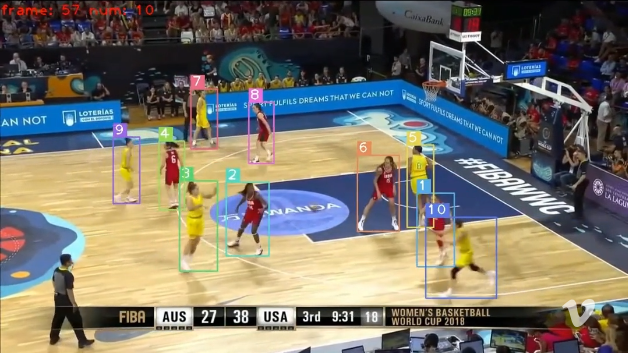
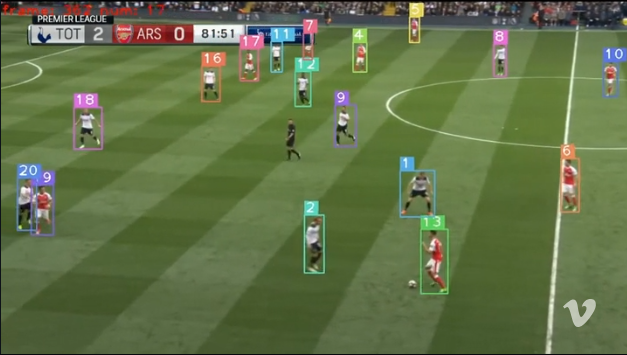
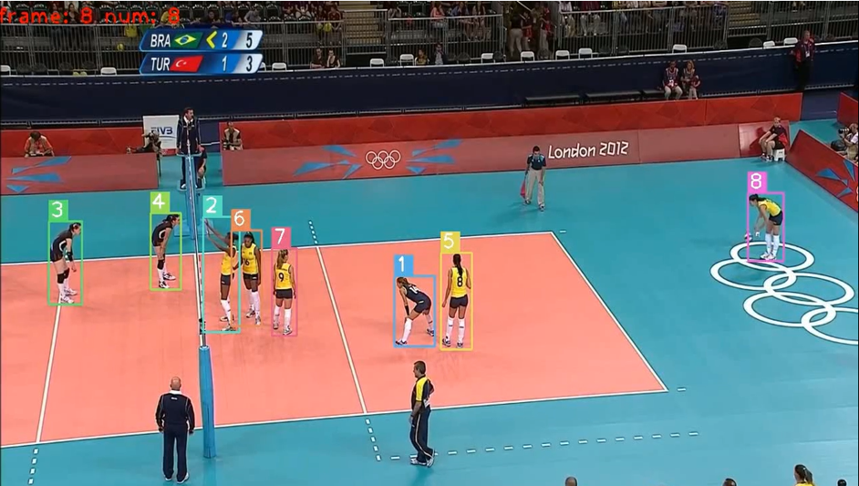

# SRITrack
Status: Under Review  
Repository Release Date: 2026-03-01

---

## 1. Introduction

SRITrack is a multi-object tracking framework designed for sports broadcasting scenarios, where frequent occlusion, dynamic camera motion, and target re-entry are common. The framework focuses on identity continuity under long-term occlusion and re-entry conditions, which are prevalent in sports videos with dynamic viewpoints and player circulation.

Under the online tracking protocol, SRITrack achieves 85.2% HOTA on the SportsMOT benchmark (train+val), highlighting its effectiveness in maintaining identity consistency in sports broadcast scenarios with frequent target re-entry.

This implementation follows a sequence-based inference pipeline using a DIRS file to load image folders and supports both:
- Private detection (run detector)
- Public detection (load det.txt)

SRITrack is built upon and inspired by several pioneering works in multi-object tracking and sports tracking. In particular, we sincerely acknowledge the following open-source projects and research contributions that provide important foundations for our implementation and experimental pipeline:

- <mark><strong>SportsMOT</strong></mark>: https://github.com/MCG-NJU/SportsMOT  
  (Sports-oriented MOT dataset and evaluation protocol)

- <mark><strong>Deep-EIoU</strong></mark>: https://github.com/hsiangwei0903/Deep-EIoU  
  (EIoU-based association and tracking design)

- <mark><strong>BoT-SORT</strong></mark>: https://github.com/NirAharon/BoT-SORT  
  (Robust ReID-aware tracking framework)

- <mark><strong>ByteTrack</strong></mark>: https://github.com/FoundationVision/ByteTrack  
  (High/low confidence detection association strategy)

We gratefully thank the authors of these works for releasing their code and datasets, which significantly facilitate research on multi-object tracking and sports analytics.

## 🎬 Demo Videos

We provide qualitative tracking demonstrations on multiple sports scenarios, 
including basketball, football, and volleyball, to illustrate the robustness 
of SRITrack.

### 🏀 Basketball Scenario
[](https://vimeo.com/1169478366)

### ⚽ Football Scenario
[](https://vimeo.com/1169477438)

### 🏐 Volleyball Scenario
[](https://vimeo.com/1169477378)

> Click the images to watch full-resolution demo videos on Vimeo.

---

## 2. Project Structure (Recommended)

```

SRITrack/
├── track.py
├── setting.yaml
├── data_path/
│   └── sportsMOT_test_path.txt
├── checkpoints/
│   ├── Detector/
│   │   └── yolox_x_sports_mix.pth.tar
│   └── ReID/
│       └── model.pth.tar-60
├── Results/
└── tracker/

```

---

## 3. Dataset Preparation

### 3.1 Required Data Format (SportsMOT Style)

Each sequence must contain an `img1` folder:

```

SportsMOT/
└── test/
├── sequence_01/
│   ├── img1/
│   │   ├── 000001.jpg
│   │   ├── 000002.jpg
│   │   └── ...
│   └── det/ (optional, for public tracking)
│       └── det.txt
└── sequence_02/
└── img1/

```

---

### 3.2 DIRS_TXT (Core Data Path Setting)

SRITrack does NOT read a dataset root directly.  
Instead, it reads a text file containing the paths of image folders.

From your `track.py`:
```

dirs = open(cfg.DIRS_TXT)
for d_path in dirs.readlines():

```

Example: `data_path/sportsMOT_test_path.txt`
```

/home/user/Dataset/SportsMOT/test/sequence_01/img1
/home/user/Dataset/SportsMOT/test/sequence_02/img1
/home/user/Dataset/SportsMOT/test/sequence_03/img1

````

Rules:
- One line = one sequence
- Must point to `img1` folder
- Absolute path is strongly recommended

---

### 3.3 Auto-generate DIRS File (Recommended)

```python
import os

root = "/home/user/Dataset/SportsMOT/test"
output = "./data_path/sportsMOT_test_path.txt"

with open(output, "w") as f:
    for seq in sorted(os.listdir(root)):
        img_dir = os.path.join(root, seq, "img1")
        if os.path.isdir(img_dir):
            f.write(os.path.abspath(img_dir) + "\n")

print("DIRS file generated:", output)
````

---

## 4. Model Weights

### 4.1 YOLOX Detector Weights

Please download from the official SportsMOT repository:
[https://github.com/MCG-NJU/SportsMOT](https://github.com/MCG-NJU/SportsMOT)

Suggested placement:

```
checkpoints/Detector/yolox_x_sports_mix.pth.tar
```

Then set in `setting.yaml`:

```yaml
det_ckpt: "./checkpoints/Detector/yolox_x_sports_mix.pth.tar"
```

---

### 4.2 ReID Weights

Please download from:

```
https://drive.google.com/file/d/12tcJ6h5dQob3qf7OI1fz7-wJ3JZUKCOt/view?usp=sharing
```

Suggested placement:

```
checkpoints/ReID/model.pth.tar-60
```

Then set in `setting.yaml`:

```yaml
reid_ckpt: "./checkpoints/ReID/model.pth.tar-60"
```

---

## 5. Configuration File (setting.yaml)

Key fields based on your current pipeline:

```yaml
# Basic setting
TRACKER: "MY"
DIRS_TXT: "./data_path/sportsMOT_test_path.txt"
BENCHMARK: "SportsMOT"
public_tracking: False
device: "cuda"
fps: 25

# Detector
exp_file: "yolox/yolox_x_ch_sportsmot.py"
det_ckpt: "./checkpoints/Detector/yolox_x_sports_mix.pth.tar"

# ReID
reid_backbone: "dinov3_vit_b_16"
reid_ckpt: "./checkpoints/ReID/model.pth.tar-60"
```

---

## 6. Public Tracking

Your `track.py` uses:

```python
if cfg.public_tracking:
    det_path = d_path.replace("img1", "det/det.txt")
else:
    det_path = None
```

### public_tracking = False (Default)

* Uses YOLOX detector
* Requires `det_ckpt`
* Suitable for private tracking experiments

### public_tracking = True

* Does NOT run detector
* Loads detections from:

```
sequence_folder/det/det.txt
```

Example:

```
sequence_01/
├── img1/
└── det/
    └── det.txt
```

Use this mode for:

* Benchmark evaluation (SportsMOT public detections)
* Fair comparison with other trackers
* Faster inference (no detection stage)

---

## 7. How to Run SRITrack

### 7.1 Basic Run (Single Setting)

```bash
python track.py -c setting.yaml
```

Execution flow:

1. Load YAML config
2. Read DIRS_TXT sequence list
3. Build detector and ReID model
4. Loop through each sequence
5. Save results to `Results/timestamp/`

---

### 7.2 Run with Bash Script (Recommended for Experiments)

Create `run_setting.sh`:

```bash
#!/usr/bin/env bash

SCRIPT="track.py"
CONFIG="setting.yaml"

echo "======================================"
echo "Running SRITrack with config: $CONFIG"
echo "======================================"

python $SCRIPT -c $CONFIG
```

Make it executable:

```bash
chmod +x run_setting.sh
./run_setting.sh
```

---

## 8. Output

After running, results will be saved automatically:

```
Results/
└── 2026_XX_XX_XX_XX_XX/
    ├── logs.txt
    └── tracking results (MOT format)
```

Controlled by:

```yaml
save_result: True
save_image: False
```

---

## 9. Recommended Settings for SportsMOT

| Setting         | Recommended Value | Reason                   |
| --------------- | ----------------- | ------------------------ |
| with_reid       | True              | Identity consistency     |
| vp_dga          | True              | Visual-priority matching |
| ris             | True              | Boundary filtering       |
| public_tracking | False (benchmark)  | Fair evaluation          |

---

## 10. Notes

* Use absolute paths in DIRS_TXT for stability
* Ensure weights paths are correct before running
* `public_tracking=True` will ignore detector weights


